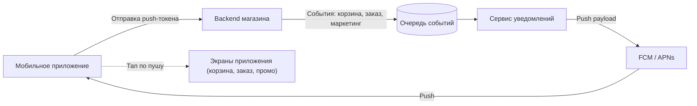

```mermaid
flowchart LR
    App[Мобильное приложение] -->|Отправка push‑токена| Backend[Backend магазина]
    Backend -->|События: корзина, заказ, маркетинг| Queue[(Очередь событий)]
    Queue --> Notification[Сервис уведомлений]
    Notification -->|Push payload| FCM[FCM / APNs]
    FCM -->|Push| App
    App -.->|Тап по пушу| Screens["Экраны приложения (корзина, заказ, промо)"]

```
